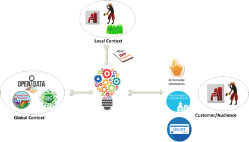

# Lesson 1.1 Data for Agriculture

## Learning outcomes

At the end of this lesson, learners will \(be able to\):

* Understand the value of data in agriculture to support farmers, increase their income and develop food production. 
* Identify the type of services that data enables 
* Understand the two main categories of data: Global data and farm-level data 
* Identifying key datasets in farming crop cycles 
* Understand how and why farm-level data can be collected and exploited

## 1.   Introduction

The aim of this lesson is to present the concept of the data revolution in agriculture and show how data and ICT for agriculture services can support smallholder farmers in addressing their challenges, increasing their incomes and their yields. The number of such services has exploded in the last few years\[1\], but they are still reaching a relatively low number of farmers\[2\]. This lesson presents the type of services that are potentially impactful, and the different elements required to build and deliver them.

The first section introduces the state of agriculture, its role and the challenges involved in feeding the world in the next few decades. This section also presents the potential of ICT services coupled with data exploitation to address these challenges. The second section presents in more detail what data consists of at farm level, and how it can be captured. The third section introduces the list of open datasets that are useful to provide actionable information\[3\] to farmers. Finally, the last section presents emerging applications and new trends on data analytics, artificial intelligence and machine learning.

## 2.   Opportunities for data in agriculture

Smallholder farmers represent the biggest employment sector in rural areas of the developing world, and they are also the most important contributors to the global food production. More than 90% of the farms in the world are family farms; they produce 80% of the food and they operate 75% of the farmland\[4\]. **Figure 1** below shows data from the FAO Smallholder Data Portrait\[5\]:

![Figure 1 Proportion of national food production by smallholders\[6\]](../.gitbook/assets/image%20%289%29.png)

This data shows the importance of smallholder farmers and their contribution to food security. However, the evolution of global food production versus consumption and evolution of the world demography shows that there is a strong need for increasing yield. The FAO 2019 report on the state of food security and nutrition in the world\[7\] highlights some worrying facts:

* Hunger and undernourishment in the world have stopped declining since 2015 and still affect almost 11% of the world population. This means that in absolute terms the number of people suffering from hunger is increasing.
* In 2019, more than 2 billion people “do not have regular access to safe, nutritious and sufficient food”.

The graphic below \(**Figure 2**\) from the World Resources Institute summarizes the challenge the world is facing in terms of food production.

![Figure 2 Creating a sustainable food future for 2050\[8\]](../.gitbook/assets/image%20%285%29.png)

At the same time, climate change is also severely impacting yields. For example, IFPRI estimated in a report\[9\] that rainfed maize yields in some regions of Africa could decrease by as much as 25% by 2050 compared with levels in 2000.

One of the most promising opportunities to address this multi-faceted challenge is to work towards increasing yields. The graphic below \(**Figure 3**\) illustrates the challenge of yield gaps and the opportunity:

![Figure 3 Average yields in Africa vs. best practices\[10\]](../.gitbook/assets/image%20%2823%29.png)

These gaps could be addressed by providing more support to farmers and by enabling them to access more services such extension services, trade services or financial services. These services can nowadays be provided at scale through ICT, as Dalberg estimates 85% of farmers’ households will have a mobile phone by 2025 \(Source: The Digitalization of African Agriculture Report 2018–2019\). As an illustration of this opportunity, the same group shows that the bundling of three services \(access to finance, advisory services, market linkages\) can lead up to a 57% increase in income for farmers, and up to 168% increase in yield.

While the use of ICT technologies is the most promising way to deliver services at scale, the content of these services and their ability to deliver accurate actionable information or results depends on their ability to aggregate different sources of data. For example, see the Bill Gates video “More Data, Better Farms” showing one of his projects \([https://www.microsoft.com/en-us/research/publication/bill-gates-features-farmbeats-on-gatesnotes/](https://www.microsoft.com/en-us/research/publication/bill-gates-features-farmbeats-on-gatesnotes/)

There is a wide scope of application for these approaches. For example, understanding the cause of the underperformance of some crops will lead policymakers to put in place appropriate legislation, subsidy schemes and interventions to address the issues. Access to detailed field information helps credit companies to build a reliable credit profile and deliver loans to smallholder farmers more easily. At the same time, if farmers, at each stage of the crop cycle, can access timely actionable information, they will be able to take informed decisions on the best way to get the most of their fields in a sustainable eco-friendly way.  The benefits of such approaches are not limited to farming and crops but the same applies to other activities in the agriculture sector. An example is presented in the video linked below, showing how the use of data supports small-scale fishermen in their operation and how collection of data is critical for them to access financial services: [https://www.youtube.com/watch?v=sxY-skVv7Mk&feature=youtu.be](https://www.youtube.com/watch?v=sxY-skVv7Mk&feature=youtu.be)

The types of services that are potentially useful and impactful for farmers are represented in the diagram below \(**Figure 4**\):

There are four main categories:

1. **Production-related services**: All the services from pre- to post-harvest to assist farmers to extract the greatest value from their assets and to combat any pest or disease that may endanger the harvest.
2. **Financial services**: A range of financial services are essential to support agricultural activities including traditional banking services, micro finance and subsidy schemes.
3. **Trade & market services**: This area includes all services that ease access to market and support farmers in getting the best prices for their commodities.
4. **Registration services**: These services encompass cooperatives and farmers group services towards their members. This category includes membership management and communication.

Some exciting initiatives by farmer-based businesses and organizations in Africa who are realizing benefits for smallholders through Digitalization in Agriculture can be seen in the following video: [https://youtu.be/8du0UCFHmao?t=](https://youtu.be/8du0UCFHmao?t=)[107](https://youtu.be/8du0UCFHmao?t=107)

For the majority of stakeholders, the design of service resides in the mash-up of global data \(e.g. satellite images, research studies, databases of information about crops, seeds, pests & diseases, etc.\) with farmer-level \(credit records, field ownership documentation, etc.\) and field-based information \(e.g. soil information, geographic location, state of the fields, crops etc.\) to determine the content \(e.g. appropriate information to take decision\). The results at the farmer level are both the availability of new products to support their production \(credit, insurance, etc.\) and the availability of timely information to support decision making. **Figure 5** below summarizes this view.

The next sections explore each of the two categories of data in detail.

## 3.   Data at farm level

Farm-level data is the essential element in delivering actionable tailored farmer-centric services and information to individual farmers. The information about the farm and the farmer can be categorized in different components that are useful for different types of services. The first part of this section presents the categories of information and their usefulness for different types of services. The second part presents the different means to collect this data.

### 3.1. Data and usage

The main categories of data at the farm-level are presented below. It is important to note that the exact set of information within each category may significantly vary depending on the specific service designed that may require or not specific information. The content varies significantly from country to country. For example, in some countries the name of a person is not meaningful without knowing the father's name. Some countries may have implemented a robust identity scheme that makes the ID number valuable information, while in other countries this may not be reliable information.

* **Personal Information**: This component contains the profile and lists the information about the farmer’s identity \(name, ID number, birthdate, gender, language spoken, income level, education level/literacy level, number of people in the household …\). Note that some information, such as the literacy level or the languages known, is usually critical to design accessible ICT services.
* **Communication information**: Communication information covers all information to interact with the farmer either directly or through broadcast media. It includes information such as phone number\(s\), phone type \(smartphone, basic phone, etc.\), phone literacy \(ability to use different technologies on phone such as SMS or app\), email, social networks used, or radio/TV listened \(and at which time\). This data is particularly useful to understand the most efficient way to deliver services and information to the farmer
* **Location**: Location information is critical to locate the farmer. It usually includes information such as administrative address \(split by administrative divisions such as region, district …\) and GPS coordinates.
* **Financial instruments**: Information about financial instruments available at the farmer level is critical for financial services \(e.g. credit, insurance or subsidies payments\). It includes information about bank accounts, including mobile money accounts
* **Credit information:** Credit information is critical to support access to credit. It includes information such as credit record, farm business plan \(to identify cash needs and timing of repayment during a complete crop cycle\), SACCOs/ROSCAs membership, active credit information
* **Insurance information:** Insurance information is also an important set of information for different purposes such as credit but also to identify covered and uncovered risks. Information includes field\(s\) covered, risk\(s\) covered, cost, company, amount repaid in case of the risk\(s\) materialize.
* **Farm details:** Information about the farm as an enterprise is critical to identify specific needs and interventions to support its activities. Key information includes registration number \(if the farm is a formal registered business\), labour force available on the farm, equipment \(for planting, harvesting, post-harvesting\) or the \(list of\) extension agent\(s\) associated with the farm/farmer. In the same case, when the farm is a formal business, it is characterized by its financial data \(turnover, benefit, etc.\). In the case of smallholder farmers, the farm financial data is usually the same as the farmer financial data. In some cases, it may be appropriate to separate the two.
* **Qualification and certification data:** Qualification and certification apply to either the farm or the farmer, sometimes down to some specific fields. Most certification requires training first. However, some training does not lead to any certification. This information is critical for many purposes. First, most certifications have regulations on various activities from planting to applying treatment to harvesting. Extension services must adapt to these constraints. Then, certifications provide added value to the end-product, and this is critical for the marketing activities. Finally, knowing a farmer’s certifications enables him to more easily access other certifications. This, for example is the objective of a service like Standard Maps\[11\]  that lets a farmer know, based on their current certifications and the ones they want to reach, the set of modules they need to follow. The information required for qualification and certification includes training/certification name/label, training/certification date or training/certification institution.
* **Field information**: In many cases, a farmer manages more than one field in different places, or even if he has one piece of land, the space is split into sections with different crops. Core field information includes location\[12\], size \(the size may be available on the land title, evaluated by the farmer or automatically computed if a field map is provided\), elevation \(important for some crops\), soil, land title and crop history. Field information also include crop information \(crop, variety, type of seeds\). The crop information is highly dependent on the type of commodity grown: trees \(coffee, cocoa, coconut, …\) or tea are very different compared to seasonal crops. The crop information must therefore be adapted
* **Production information:** The production information is usually linked to a field. This information is usually useful for extension service and to prepare trade or post-harvest activities. It usually includes planting information \(date, spacing, intercropping information, equipment, amount of seeds used\), activities information \(treatment applied, fertilizer, extension service interventions, pest & disease attacks & treatments, activities such as weeding, water usage, yield, loss, rainfall, …\). Here again the production information is directly related to the specificities of the crop.
* **Business information:** Business information is a critical element for marketing and selling of the yields or transformed products. This information describes the linkages between the farmer and other key stakeholders in the value chain for conducting his/her businesses. It includes information such as cooperatives/production cluster membership, markets the farmers is linked to, agribusinesses linkages, total amount of products sold \(per trade channel such as cooperative, at market, at farm gate\) and prices sold.

### 3.2. Data capture

There are different ways to capture the data presented in the previous section. The diagram below summarizes the main approaches:

![Figure 6 Ways of capturing data\[13\]](../.gitbook/assets/image%20%287%29.png)

There are roughly three main options, which are usually complementary:

1. **Direct on-farm capture**: The data is collected through human interaction by a data collector visiting the farmer. The data collection activity could be done on paper or use more advanced smartphone tools.
2. **Remote capture via mobile phone**: The fact that many farmers have nowadays a phone can be exploited to collect data remotely. There are mainly two ways to capture data:
3. **Direct capture through farmer contributions**: Data are collected from farmers \(like for the first case\) but remotely. Such collection can take different forms: a person-to-person call \(via call centre\), a basic phone application \(voice-based application, USSD, SMS\), or a smartphone application
4. **Indirect capture through big data**: Mobile operators are able to extract a large quantity of information from each of their clients. This includes e.g. usage of their phone, or usage of specific mobile services such as mobile money. This data is valuable and can complement other information in a farmer profile. Capturing, storing and exploiting this data requires partnership with mobile operators who are the only ones with access to this information. Farmers have obviously to be aware and have to consent to such data collection \(see lesson 2.4 on personal data protection\)
5. **Automatic capture using specific technologies**: There are a series of new technologies that can be used to capture some information automatically. In particular, this includes drones for field mapping and analysis, and sensors \(also known as Internet of Things technology or IOT\). See for example FarmBeats, an initiative around IoT from Bill Gates: [https://www.microsoft.com/en-us/research/project/farmbeats-iot-agriculture/](https://www.microsoft.com/en-us/research/project/farmbeats-iot-agriculture/)

Other technologies include also big data approaches used to analyze farmers behaviour online \(e.g. on social media\), but these approaches are still largely irrelevant for smallholder farmers in developing countries. Technologies such as satellites are more related to capturing global data.

## 4.   Identifying key datasets in farming crop cycles

There are numerous datasets that are potentially useful to deliver information and services to farmers. Some datasets might be useful at different stages of the crop cycle\[14\], but with different requirements. One such example is market prices. Market prices are useful when selecting the crop to grow, if they have a time series showing the recent evolution of prices in the past years. Market prices are also useful at the selling stage, but at this stage this dataset must have nearly real-time information to be useful. Some datasets are obviously available at the country level only, but some others may be available in the country or at the regional or international level \(e.g. weather data or satellite images\).

For further reading on this topic we recommend the GODAN Agriculture Open Data Package\[15\], and the presentations made at the big data session of the USDA/USAID International Food Assistance and Food Security Conference in 2016\[16\]. The following table presents the different categories of datasets, the individual datasets\[17\], and the type of applications that can be built on top of them.

Table 1 Categories of datasets, individual datasets and applications

<table>
  <thead>
    <tr>
      <th style="text-align:left"><b>Categories</b>
      </th>
      <th style="text-align:left"><b>Datasets</b>
      </th>
      <th style="text-align:left"><b>Examples of services</b>
      </th>
    </tr>
  </thead>
  <tbody>
    <tr>
      <td style="text-align:left">Government, agricultural law and regulations</td>
      <td style="text-align:left">
        
(Phyto) sanitary regulations (list of quarantine organisms, etc.), environmental
          regulations, subsidy schemes, import/export regulations

        
Example: <a href="http://kenyalaw.org/">http://kenyalaw.org/</a> public
          portal on all laws of Kenya

      </td>
      <td style="text-align:left">Advisory service on the crops and varieties to grow based on legal framework
        and subsidy schemes[18],</td>
    </tr>
    <tr>
      <td style="text-align:left">Official records</td>
      <td style="text-align:left">
        
Land registration, licensed organizations (corporations, business, NGOs),
          import/export tariffs, permitted crop protection products.

        
Example: Land registration in France (French only) <a href="https://app.dvf.etalab.gouv.fr/">https://app.dvf.etalab.gouv.fr/</a>;

        
California authorized Pesticides <a href="https://www.cdpr.ca.gov/docs/label/labelque.htm">https://www.cdpr.ca.gov/docs/label/labelque.htm</a>
        

      </td>
      <td style="text-align:left">Determining ownership/rights to use the land, advocating for land reform
        and new land record management, etc.</td>
    </tr>
    <tr>
      <td style="text-align:left">Government finance data</td>
      <td style="text-align:left">
        
Agricultural subsidy expenditure (direct payments, product support, tariffs
          etc.), agriculture-related tax income, penalties given to agricultural
          actors, investment in research and education (extension, research institutes,
          professional training and universities).

        
Example: Albania Finance Portal: <a href="http://isdatabank.info/albania/">http://isdatabank.info/albania/</a>,

        
Uganda Budget data from 2003 till 2017: <a href="https://bit.ly/2z1Eqmx">https://bit.ly/2z1Eqmx</a>
        

      </td>
      <td style="text-align:left">Forecasting impact of change in subsidy schemes, raising awareness on
        penalties risk</td>
    </tr>
    <tr>
      <td style="text-align:left">Rural development project data</td>
      <td style="text-align:left">
        
General project information, including financial data, location, beneficiaries,
          activities, project output, outcome and impact, project documents.

        
Example: IATI data of all UKAID sponsored projects. <a href="https://devtracker.dfid.gov.uk/">https://devtracker.dfid.gov.uk/</a>
        

      </td>
      <td style="text-align:left">Identifying existing initiatives to leverage</td>
    </tr>
    <tr>
      <td style="text-align:left">Land use and productivity data</td>
      <td style="text-align:left">
        
Land use data, cultivated areas, current crop in the fields, harvested
          crop, crop types

        
Example: India Land Use information: <a href="https://bit.ly/2MdcNjn">https://bit.ly/2MdcNjn</a>
        

      </td>
      <td style="text-align:left">Ensure land use rights to cultivate the land, forecasting production,
        providing advisory services for traders on where crops are being grown,
        providing advisory services on pest and disease related to specific crops.</td>
    </tr>
    <tr>
      <td style="text-align:left">Value chain data</td>
      <td style="text-align:left">
        
Profiles of different value chain actors and organizations
           - Farm data, e.g., farming system, crops, land area, farm income, household
          composition, farm employment, farm holder&apos;s age, fertilizer use etc.
           - Cooperatives
           - Trade
           - Processors, e.g. type, size, turnover, capital, investments, environmental
          transparency indicators etc.
           - Retail,

        
(Food) product data, e.g. food nutritional value, food composition, origin
          of produce, environmental factors, time and location of production, etc.

        
(Safety) inspection results

        
Certification

        
Example : US Livestock and Poultry industries analysis <a href="https://www.gipsa.usda.gov/psp/publications.aspx">https://www.gipsa.usda.gov/psp/publications.aspx</a>
        

        
UL Mad Cow disease inspection data: <a href="https://bit.ly/2MgmddD">https://bit.ly/2MgmddD</a>
        

      </td>
      <td style="text-align:left">Leveraging linkages (farmers/input dealers&#x2019; link, market linkages,
        etc.)</td>
    </tr>
    <tr>
      <td style="text-align:left">Infrastructure data</td>
      <td style="text-align:left">
        
Road network and conditions, road maintenance schedule, public transport,
          waterways, internet connectivity map, mobile connectivity map.

        
Example: Canada British Columbia publishes traffic data (that can e.g.
          be used to minimize transport for perishable goods) <a href="http://www.th.gov.bc.ca/trafficData/index.html">http://www.th.gov.bc.ca/trafficData/index.html</a>
        

      </td>
      <td style="text-align:left">Transport services, applicability of different types of ICT services (GSM-based
        services vs internet-based services)</td>
    </tr>
    <tr>
      <td style="text-align:left">Market and price data</td>
      <td style="text-align:left">
        
Global food prices, national stock exchange prices, regional market prices,
          local market prices, location of national, regional and local markets,
          import/export volume

        
Example Ethiopia Commodity Exchange: <a href="http://www.ecx.com.et/">http://www.ecx.com.et/</a>
        

      </td>
      <td style="text-align:left">Market price information, Support for decision making on market access,
        support on price bargaining, etc.[19]</td>
    </tr>
    <tr>
      <td style="text-align:left">Meteorological data</td>
      <td style="text-align:left">
        
Short-term weather forecast, detailed <a href="https://en.wikipedia.org/wiki/Agrometeorology">agrometeorological data</a>[20],
          seasonal weather forecasts (3-6 months ahead), real-time observations,
          historic archives of observations, historical simulated weather from re-analysis,
          climatological observations, climatological reference data, climate zones,
          climate change predictions, rainfall data

        
Example: Australia real-time climate data <a href="http://www.bom.gov.au/climate/data/">http://www.bom.gov.au/climate/data/</a>
        

      </td>
      <td style="text-align:left">Identify the crops and the varieties to grow based on local conditions
        such as climate zone; agro-ecological zone; weather forecast, soil or global
        appropriateness of the field (e.g. flooding risks), supporting farmers
        in the schedule of their activities (seeding, harvesting, etc.). Alerting
        and preventing damage from severe meteorological events[21]</td>
    </tr>
    <tr>
      <td style="text-align:left">Elevation data</td>
      <td style="text-align:left">
        
Digital elevation model, elevation maps, height points, slope, aspect[22],
          catchments, drainage, erosion susceptibility

        
Example: CGIAR STRM 90m digital elevation database: <a href="http://srtm.csi.cgiar.org/">http://srtm.csi.cgiar.org/</a>
        

      </td>
      <td style="text-align:left">Identification of high-value production and setup of geographically certified
        products[23]</td>
    </tr>
    <tr>
      <td style="text-align:left">Hydrological data</td>
      <td style="text-align:left">
        
Location of water sources flood zones, historical records on flooding,
          real-time water levels, water quality, water tables, water management

        
Example: UK flood risks data: <a href="https://www.shoothill.com/Floods&amp;Rivers">https://www.shoothill.com/Floods&amp;Rivers</a>
        

      </td>
      <td style="text-align:left">Alerting and decreasing the impact of flood, alerting farmers on water
        availability and quality for farming</td>
    </tr>
    <tr>
      <td style="text-align:left">Soil data</td>
      <td style="text-align:left">
        
Soil maps, soil samples, soil classifications

        
Example: ISRIC (International Soil Reference and Information Centre) soil
          database: <a href="https://www.isric.org/explore">https://www.isric.org/explore</a>
        

      </td>
      <td style="text-align:left">Selecting the best crop and the best inputs based on soil information</td>
    </tr>
    <tr>
      <td style="text-align:left">Production advice data</td>
      <td style="text-align:left">
        
Data on cultivars, landraces and farmer varieties including new releases;
          rop selection advice including new releases; crop calendars, intercropping,
          relay cropping, rotation; resource-related farm advice[24]; fertilizer
          recommendations

        
Example: FAO TECA (Technologies and Practices for Small Agricultural Producers)
          database <a href="http://www.fao.org/teca/new-search-result/en/">http://www.fao.org/teca/new-search-result/en/</a>
        

      </td>
      <td style="text-align:left">Extension services across the crop cycle from land selection, crop selection,
        up to harvest and post-harvest</td>
    </tr>
    <tr>
      <td style="text-align:left">Disease and pest management data</td>
      <td style="text-align:left">
        
Occurrences and distribution of plant pests; treatment of pests and diseases;
          recognition of pests and diseases; biology of pests and diseases; toxicology
          or plant protection measures

        
Example: Plantwise application from CABI <a href="https://www.plantwise.org/KnowledgeBank">https://www.plantwise.org/KnowledgeBank</a>
        

      </td>
      <td style="text-align:left">Detection and curation of pest &amp; disease, alert on disease outbreak</td>
    </tr>
  </tbody>
</table>## 5.   Data analytics, artificial intelligence and machine learning

The mash-up of farm-level data and global datasets allows the generation of a huge volume of information. To date, most of the services available have been relatively basic, consisting of a human analysis of these data on a particular use-case and the use of ICT to deliver the service. New approaches, in particular blockchain\[25\], data science, artificial intelligence and machine learning, offer new opportunities in the future. In particular, this includes predictive analysis such as yield forecasts that will inform all the value-chain actors, from public authorities with early warning on potential food security risks up to traders. These future approaches will be made possible through a greater availability of data. As farm-level data are more available, as automatic data collection through ,e.g., sensors starts to spread at scale, and as governments, international organizations, and all actors including the private sector release more open datasets and increase access to big data streams, the volume of data will grow exponentially, offering more opportunities for more advanced predictive automatic services. These services provide more added-value and at lower costs than the current generation of ICT services, making them more impactful and more sustainable. The trend is clear\[26\] and is likely to lead to a new wave of services in the coming years with both the availability and the development of capacities on data science that is taking place in almost all countries of the world\[27\].

## 6.   Summary

In this lesson, you were introduced to the potential of data and ICT services in agriculture to transform the way smallholder farmers manage their farm and their field, and to support them in addressing the worldwide food production challenge. While this data and the ICT revolution are currently reaching only a small fraction of farmers, the overall results are promising. To scale up and amplify this revolution, more data are needed, both from the farm and at the global level. The second section of this lesson presents the high-value information available at the farm level and methods of capturing it. Farmers’ organization, cooperatives, governments or any organization managing farmers are well placed to aggregate and make available these farm-level data. This process is presented in the next lesson. The third session presents the list of datasets that are also critical to support service providers. Governments are encouraged to release these datasets, and all other stakeholders from the agriculture sector should advocate in their countries for such release, to ensure that all the conditions for the design, development and deployment of transformative data-based ICT services are met.

## Bibliography

* African Development Bank Group 2016 Feed Africa Strategy for Agricultural Transformation in Africa 2016–2025. [https://www.afdb.org/fileadmin/uploads/afdb/Documents/Policy-Documents/Feed\_Africa-Strategy-En.pdf](https://www.afdb.org/fileadmin/uploads/afdb/Documents/Policy-Documents/Feed_Africa-Strategy-En.pdf)
* Boyera, S., Addison, C. and Msengezi, C.  2017. Farmer profiling: making data work for smallholder farmers. CTA Working Paper 17/09 CTA, Wageningen, Netherlands. [https://cgspace.cgiar.org/handle/10568/89763](https://cgspace.cgiar.org/handle/10568/89763)
* FAO, IFAD, UNICEF, WFP, and WHO 2019, The State of Food Security and Nutrition in the World 2019.  Safeguarding against economic slowdowns and downturns. FAO, Rome, Italy. [http://www.fao.org/3/ca5162en/ca5162en.pdf](http://www.fao.org/3/ca5162en/ca5162en.pdf)
* FAO Smallholders dataportrait, Open Dataset [http://www.fao.org/family-farming/data-sources/dataportrait/production/en/](http://www.fao.org/family-farming/data-sources/dataportrait/production/en/) \(accessed August 2019,\)
* GODAN Agriculture Open Data Package 2018.  [https://www.godan.info/sites/default/files/GODAN\_AG\_Open\_Data\_Package\_PRINT\_1.pdf](https://www.godan.info/sites/default/files/GODAN_AG_Open_Data_Package_PRINT_1.pdf) [https://airtable.com/shrEopYb0aQbD0bOe/tblpwORQSAkqYWWAL?backgroundColor=green&viewControls=on&blocks=hide](https://airtable.com/shrEopYb0aQbD0bOe/tblpwORQSAkqYWWAL?backgroundColor=green&viewControls=on&blocks=hide)
* Maru, A. et al. 2018. Digital and data-driven agriculture: Harnessing the power of data for smallholders. Global Forum on Agricultural Research and Innovation, Rome, Italy. [https://cgspace.cgiar.org/handle/10568/92477](https://cgspace.cgiar.org/handle/10568/92477)  
* NUCAFE \(blog post\) 2018, Value addition through digitalisation for Ugandan coffee farmers, [https://www.nucafe.org/index.php/media-centre/latest-news/184-value-addition-through-digitalisation-for-ugandan-coffee-farmers](https://www.nucafe.org/index.php/media-centre/latest-news/184-value-addition-through-digitalisation-for-ugandan-coffee-farmers)
* Searchinger, T., Waite, R., Hanson, C., Ranganathan, J., Dumas, P. and Matthews, E. 2018. Creating a Sustainable Food Future: A Menu of Solutions to Feed Nearly 10 Billion People by 2050, World Resources Institute, Washington DC, USA. [https://www.wri.org/publication/creating-sustainable-food-future](https://www.wri.org/publication/creating-sustainable-food-future).
* Spore Magazine, N°190, September-November 2018, Serving Smallholder Farmers In A Digital Age [https://cgspace.cgiar.org/bitstream/handle/10568/97500/Spore-190-EN-web.pdf](https://cgspace.cgiar.org/bitstream/handle/10568/97500/Spore-190-EN-web.pdf)  
* Stamoulis K. et al., 2014, The State of Food and Agriculture, 2014, FAO, Rome, Italy. [http://www.fao.org/publications/sofa/2014/en/](http://www.fao.org/publications/sofa/2014/en/)  
* Sylvester G. 2019. E-agriculture in action: Blockchain for agriculture, FAO/ITU, Rome, Italy. [http://www.fao.org/3/CA2906EN/ca2906en.pdf](http://www.fao.org/3/CA2906EN/ca2906en.pdf)
* Trendov, N., Varas, S. and Zeng, M. 2019, Digital Technologies in Agriculture and Rural Areas, FAO, Rome, Italy. [http://www.fao.org/3/ca4985en/ca4985en.pdf](http://www.fao.org/3/ca4985en/ca4985en.pdf)
* Tsan, M., Totapally, S.,,Hailu, M. and Addom, B. 2019. The Digitalisation of African Agriculture Report, 2018-2019, CTA, Wageningen, Netherlands [https://cgspace.cgiar.org/bitstream/handle/10568/101498/CTA-Digitalisation-report.pdf](https://cgspace.cgiar.org/bitstream/handle/10568/101498/CTA-Digitalisation-report.pdf)   
* USDA/USAID International Food Assistance and Food Security Conference, 2016, Proceedings, [https://www.agrilinks.org/library/event-resources-usdausaid-international-food-assistance-and-food-security-conference](https://www.agrilinks.org/library/event-resources-usdausaid-international-food-assistance-and-food-security-conference) 

## Footnotes

\[1\] For example, in Africa, 41 services were identified in 2012 and 390 in 2018. Source: Michael Tsan et al., 2019. The Digitalisation of African Agriculture Report, 2018-2019, June 2019, CTA, Wagneingen, Netherlands. Available online from: [https://www.cta.int/en/digitalisation-agriculture-africa](https://www.cta.int/en/digitalisation-agriculture-africa).

\[2\] For example, in Africa, around 33 million farmers have access to such ICT services, which is less than 10% of the total number of farmers. It is however expected that ICT services will reach 200 million farmers by 2030. Source: Michael Tsan et al., 2019. The Digitalisation of African Agriculture Report, 2018-2019, June 2019, CTA, Wagneingen, Netherlands. Available online from: [https://www.cta.int/en/digitalisation-agriculture-africa](https://www.cta.int/en/digitalisation-agriculture-africa).

\[3\] Actionable information is data that is easily understandable and that can be directly used to make a decision or solve a problem. The concept of “actionable information” is linked to the capacities, knowledge and environment of the person accessing the information, i.e. what is actionable to someone may be unusable by someone else with a different background.

\[4\] The State of Food and Agriculture 2014: Innovation in Family Farming 2014. FAO - Food and Agriculture Organization of the United Nations, Available online from:  [http://www.fao.org/publications/sofa/2014/en/](http://www.fao.org/publications/sofa/2014/en/).

\[5\] George Rapsomanikis 2015. The Economic Lives of Smallholder Farmers: An Analysis Based on Household Data from Nine Countries, FAO - Food and Agriculture Organization of the United Nations. Available online from: [http://www.fao.org/3/a-i5251e.pdf](http://www.fao.org/3/a-i5251e.pdf).

\[6\] ‘Family Farming Knowledge Platform: Smallholders Dataportrait’, accessed 19 September 2019, [http://www.fao.org/family-farming/data-sources/dataportrait/production/en/](http://www.fao.org/family-farming/data-sources/dataportrait/production/en/).

\[7\] FAO/IFAD/UNICEF/WFP/WHO 2019. The State of Food Security and Nutrition in the World: Safeguarding Against Economic Slowdowns and Downturns, FAO, Rome. Available online at: [http://www.fao.org/3/ca5162en/ca5162en.pdf](http://www.fao.org/3/ca5162en/ca5162en.pdf).

\[8\] ‘This Is How to Sustainably Feed 10 Billion People by 2050’, World Economic Forum. Available online at: [https://www.weforum.org/agenda/2018/12/how-to-sustainably-feed-10-billion-people-by-2050-in-21-charts/](https://www.weforum.org/agenda/2018/12/how-to-sustainably-feed-10-billion-people-by-2050-in-21-charts/) \(accessed 20 September 2019\)

\[9\] Wiebe, K.D., Sulser, T.B., Mason-D’Croz, D. and Rosegrant, M.W. 2017. The effects of climate change on agriculture and food security in Africa. In: A Thriving Agricultural Sector in a Changing Climate: Meeting Malabo Declaration Goals Through Climate-Smart Agriculture, eds. A. De Pinto and J.M. Ulimwengu. IFPRI, Washington DC, USA. Ch.2, pp. 5–21. Available online at: [http://dx.doi.org/10.2499/9780896292949\_02](http://dx.doi.org/10.2499/9780896292949_02)

\[10\] Institut International de Recherche sur les Politiques Alimentaires, 2018. ‘Taat Policy Support Retreat’. Available online at : [https://www.slideshare.net/ifpriwcao/taat-policy-support-retreat](https://www.slideshare.net/ifpriwcao/taat-policy-support-retreat).

\[11\] [http://www.standardsmap.org/](http://www.standardsmap.org/)

\[12\] Location may have different formats: administrative location, the GPS coordinates of one point in the field or a map \(geo-fencing\) of the field. The latter offers more opportunities for specific services \(forecast of production, evaluation of inputs required etc.\) and is obviously more complex and more costly to acquire.

\[13\] USAID report on Digital Farmer Profiles: Reimagining Smallholder Agriculture [https://www.usaid.gov/sites/default/files/documents/15396/Data\_Driven\_Agriculture\_Farmer\_Profile.pdf](https://www.usaid.gov/sites/default/files/documents/15396/Data_Driven_Agriculture_Farmer_Profile.pdf)

\[14\] In this context we used the term ‘crop cycle’ as the set of stages that a farmer goes through from the selection of a commodity to plant in the field till the selling of the harvested product. The cycle is usually split into 3 main phases: \(1\) the pre-cultivation stage that includes access to finance, selection of crops, seeds, etc; \(2\) the cultivation and harvesting stage that goes from planting until harvest; and \(3\) the post-harvest stage that is mainly focused on trade and commerce, but also includes transformation when appropriate.

\[15\] [https://www.godan.info/sites/default/files/GODAN\_AG\_Open\_Data\_Package\_PRINT\_1.pdf](https://www.godan.info/sites/default/files/GODAN_AG_Open_Data_Package_PRINT_1.pdf) [https://airtable.com/shrEopYb0aQbD0bOe/tblpwORQSAkqYWWAL?backgroundColor=green&viewControls=on&blocks=hide](https://airtable.com/shrEopYb0aQbD0bOe/tblpwORQSAkqYWWAL?backgroundColor=green&viewControls=on&blocks=hide)

\[16\] [https://www.agrilinks.org/library/event-resources-usdausaid-international-food-assistance-and-food-security-conference](https://www.agrilinks.org/library/event-resources-usdausaid-international-food-assistance-and-food-security-conference)

\[17\] The list of datasets in each category is not exhaustive but mentions main elements.

\[18\] Together with other datasets such as permitted crop protection products, land use data, current crop in the fields, harvested crop, crop types

\[19\] The impact of market prices information service is one of the most documented examples of the impact of information and ICT services on revenue increase and diminution of loss for perishable products. See e.g. example of farmers in Uganda \([https://yanagizawadrott.com/wp-content/uploads/2016/02/getting-prices-right.pdf](https://yanagizawadrott.com/wp-content/uploads/2016/02/getting-prices-right.pdf) \) or fishermen in Kerala \([https://mmd4d.files.wordpress.com/2009/04/jensen-indian-fisheries.pdf](https://mmd4d.files.wordpress.com/2009/04/jensen-indian-fisheries.pdf) \)

\[20\] [https://en.wikipedia.org/wiki/Agrometeorology](https://en.wikipedia.org/wiki/Agrometeorology)

\[21\] See the example of ANACIM in Senegal sending weather alerts to fishermen: [https://www.nrc.no/expert-deployment/2016/2018/messages-for-safe-fishing-in-senegal/](https://www.nrc.no/expert-deployment/2016/2018/messages-for-safe-fishing-in-senegal/). Another example is Abalobi in South Africa where a smartphone app allows fishermen to make the best decision to go fishing or not based on weather information \(waves, tides, etc.\): [http://abalobi.info/](http://abalobi.info/)

\[22\] Aspect identifies the downslope direction of the maximum rate of change in value from each cell to its neighbours. It can be thought of as the slope direction. Aspect allows the following:

* to find all north-facing slopes on a mountain as part of a search for the best slopes
* to calculate the solar illumination for each location in a region as part of a study to determine the diversity of life at each site
* to find all southerly slopes in a mountainous region to identify locations where the snow is likely to melt first as part of a study to identify those residential locations likely to be hit by runoff first
* to identify areas of flat land. \(Source ArcGis definition [http://desktop.arcgis.com/en/arcmap/10.3/tools/spatial-analyst-toolbox/how-aspect-works.htm](http://desktop.arcgis.com/en/arcmap/10.3/tools/spatial-analyst-toolbox/how-aspect-works.htm) \)

\[23\] For an example of price increase offered to coffee maker due to their specific geographical position and their altitude see: [https://www.nucafe.org/index.php/media-centre/latest-news/184-value-addition-through-digitalisation-for-ugandan-coffee-farmers](https://www.nucafe.org/index.php/media-centre/latest-news/184-value-addition-through-digitalisation-for-ugandan-coffee-farmers)

\[24\] Data related to crop selection, crop and land management as typically found in extension services information.

\[25\] See 2019 FAO report titled “E-agriculture in action: Blockchain for agriculture” [http://www.fao.org/3/CA2906EN/ca2906en.pdf](http://www.fao.org/3/CA2906EN/ca2906en.pdf)

\[26\] The report on “digitalization of African agriculture” published by CTA shows that 60% of the current ICT service providers plan to integrate these technologies in the next three years. 

\[27\] For example, see  the new program from the Rockefeller Foundation on data science for social impact launched in January 2018 \([https://www.rockefellerfoundation.org/our-work/initiatives/data-science-social-impact/](https://www.rockefellerfoundation.org/our-work/initiatives/data-science-social-impact/) \) or the joint program from PEPFAR and the Millennium Challenge Corporation \(MCC\) on Data Collaborative for Local Impact \(DCLI\) \([https://www.mcc.gov/initiatives/initiative/mcc-pepfar-partnership](https://www.mcc.gov/initiatives/initiative/mcc-pepfar-partnership) \)

