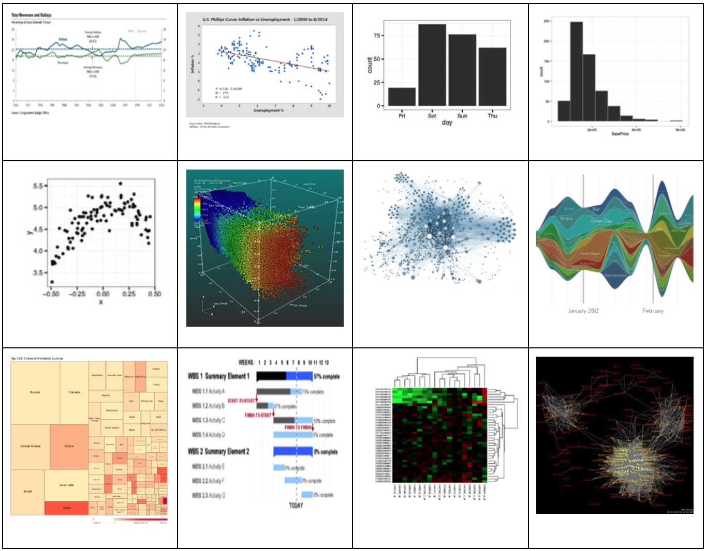
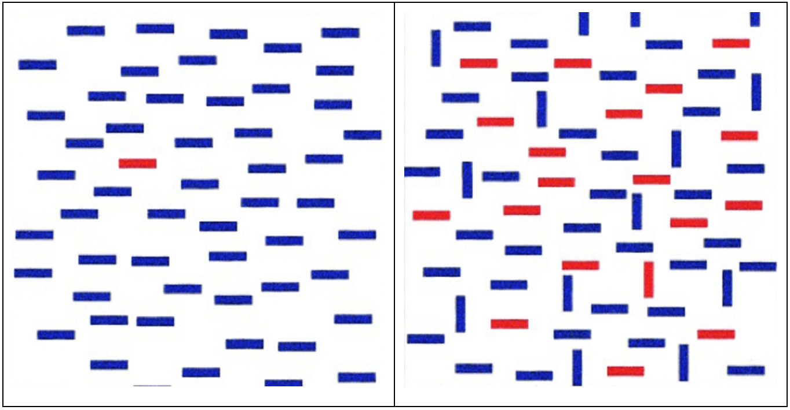

# Lesson 3.3 Data Analysis and Visualization

## Learning outcomes

At the end of this lesson, learners will \(be able to\):

* Explain why data needs to be analysed
* Prepare data for analysis
* Apply a number of techniques to analyse data
* Analyse the risks with analysing different types of data
* Explain the purpose of data visualisation
* Choose an appropriate visualisation for data
* Evaluate the effectiveness of a number of different data visualisations

## 1.   Introduction

Lesson 3.1 introduced methods for discovering data both ‘on’ and ‘in’ the web; the objective of that lesson was to introduce techniques for finding source data. Lesson 3.2 followed it with an analysis of the quality and provenance of the data and the steps required to clean and prepare the data for analysis.

This lesson looks at the next stage of data analysis and visualisation. Like the other lessons, the knowledge required will vary vastly depending on the exact object of the analysis and visualisation. This lesson aims to take a pragmatic approach to both subjects and offer a broad theory of analysis that leads to clear visualisations that generate impact. Practical examples focus on quantitative data in a spreadsheet and feature extraction-based analysis of qualitative data.

## 2.   Purpose of data analysis

Raw, unprocessed data is often messy and potentially still not ready for visualisation. This section looks at a number of techniques that can be used to turn data into information including:

* derivation and feature extraction
* dataset combining
* dataset enrichment.

### 2.1  Derivation and feature extraction

Derivation and feature extraction are similar in that they are designed to add to existing data without requiring external datasets. This results in additional columns \(or features\) being added to data which are based upon the existing data only.

#### 2.1.1. Derivation

A derived data element is a data element derived from other data elements using a mathematical, logical or other type of transformation, e.g. arithmetic formula, composition, aggregation.

For example, source data might contain a series of columns of monthly expenditure. A sum total could be made over all months to add another column. This column is thus derived from the others.

#### 2.1.2. Feature extraction

Feature extraction is very similar to derived data but does not necessarily have to involve a function. For example, the city could be extracted from a list of unstructured address data, making the city a distinct feature of the dataset. Likewise, the colour of the centre pixel of an image could be extracted without the use of a mathematical function. A short tutorial on feature extraction is available for Excel [here](https://www.extendoffice.com/documents/excel/3639-excel-extract-part-of-string.html).

### 2.2  Combining datasets

Here we are not referring to adding additional data onto the end of an existing dataset \(a process known as consolidation\), but rather the process of adding to the existing data.

If you are using a spreadsheet, the result of combining two datasets with 10 columns each will be one dataset with 19 columns. Combining data can only be done in this way if there is a column in each dataset with a shared value. This column becomes the key upon which the combination can be performed.

For example: take a dataset of roads and the numbers of cars during each hour of the day. Each hour period is a column and each road is a row. If there were many sources of the data, e.g. sources with different hours in all individually collected, then you could key on the road name and combine all the data into a single dataset.

Find out how to combine two datasets in [Excel](https://superuser.com/questions/366647/merge-two-excel-files-using-a-common-column) or in [Open Refine](https://blog.ouseful.info/2011/05/06/merging-datesets-with-common-columns-in-google-refine/).

### 2.3  Enriching geographic data

Much like combining data, where two datasets can be combined based upon a common feature \(e.g. road name\), the same can be achieved with geographic data. One big difference is that it is possible to combine geographic data based upon location and place a geographic point inside a boundary. This process is known as a spatial join.

A spatial join can be useful when looking at features of different buildings or services and mapping them onto jurisdiction region to see if any patterns emerge. For example, this could be used to see if schools in different council-controlled areas perform significantly differently.

Find out more about enriching and joining map data using the excellent guides provided by [CartoDB](https://carto.com/learn/guides).

Another essential stage in preparing geographic data for analysis is that of geocoding. Geocoding is the process of taking any reference or description of a physical location and adding the actual physical location coordinates to the data. Reverse geocoding is thus the opposite, extracting the description \(e.g. London\) from the coordinates. Geocoding can also refer to the process of transforming from one coordinate representation system \(e.g. easting–northing\) to another \(e.g. latitude–longitude\). Geocoding is essential when trying to analyse geographic data and perform other operations such as spatial joins.

## 3.   Qualitative and quantitative data analysis

There are two main types of statistical analysis talked about in data: qualitative and quantitative. Put simply, qualitative research deals with open-ended, often text-based data, while quantitative research tries to focus on objective, measurable data in the form of numbers or other structured data. Table 1 \(from the Open University\) shows some of the main differences between the two types of research.

Table 1 Qualitative vs quantitative research \(Source: Open University\)

Although Table 1 illustrates qualitative and quantitative research as distinct and opposite, in practice they are often combined or draw elements from each other. For example, a survey question could be answered on a scale of 1–10 however the question could be subject to personal bias.

Even something as simple as counting sheep can be fraught with danger: if your field also contains lambs, are these sheep? When do they become sheep?

### 3.1         Analysing quantitative data

Good quantitative researchers will seek to maintain a level of control of the different variables and carefully define both the scope and size of the sample being measured. They will also attempt to eliminate or accept the influence of other factors on the sample and outline this clearly in the research.

One of the most important aspects in research is that of obtaining a statistically significant result. Statistical significance is essentially a measure which states that there is less than a 5% chance that the result of the analysis is down to chance.

This can be explained best with coin tosses and testing if a coin is biased, which can be tested with a simple null hypothesis test. The null hypothesis is a statement about the world which can plausibly account for the data you observe, for example ‘the coin is fair’. You could then flip the coin 100 times and if heads came up only once, then it is safe to say the null hypothesis can be rejected and that the coin is biased.

But what if 51 of the 100 tosses come out heads? Or you flip the coin 100,000 times and 51,000 times it comes out heads. Can either of these be random chance, or is the coin biased?

Calculating whether a result is significant can be done in two ways, either with a statistical significance calculation or a z-score calculation. Either way, what we are trying to calculate is if the result falls outside of the 95% of observations where the null hypothesis is true, thus disproving it. As the majority of quantitative data can be mapped to a normal distribution it is this that dictates whether a result is statistically significant. On the diagram below, it can be seen that 95% of values always fall within 1.98 standard deviations from the mean \(x̄\).

A 95% level of confidence means we reject the null hypothesis if the calculation of statistical significance falls outside of the 95% of the area of the normal curve. The z-score is a calculation of how many standard deviations away from the mean the sample is.

So, with a toss of a coin with a null hypothesis that the coin is fair, based upon different amounts of flips and results we get the following:

| Coin | Flips | Percent Heads | Z-score | Biased? |
| :--- | :--- | :--- | :--- | :--- |
| \#1 | 100 | 51% | 0.2 | No |
| \#2 | 100 | 60% | 2.00 | Yes |
| \#3 | 50 | 60% | 1.41 | Not significant |
| \#4 | 50 | 65% | 2.12 | Yes |

Here it can be seen that as the sample size increases, so the significance can be observed with the same percentage of coin tosses that come out heads.

Sample size is one key factor and it helps eliminate the chance of other factors having an effect, such as the coin always being tossed the same way, with the same force and from the same position. However, some tests might require this kind of absolute control when the sample size is small, for example comparing the shatter resistance of [expensive phones](http://bgr.com/2017/09/25/iphone-8-plus-vs-galaxy-note-8-drop-test-glass/).

With the majority of quantitative analysis focusing on averages, sample size is important to get rid of the effect of outliers on the data. Additionally, it is important to pick the most representative average for the dataset, as the mean is not always an accurate reflection of the data if there are outliers in that data. For example, in President Bush's 2008 State of the Union Address he attacked his opposition, stating that their tax plans would mean an average tax hike of $1800 per person. However, this was the mean value and people's earnings are not evenly distributed; the proposals actually hit high earners badly, while putting money back in the pockets of those who needed it.

It is not just sample sizes that affect the significance of a result, however, and there are other factors that need to be eliminated first before a result can be declared significant:

**Fluctuation**

Random events cluster, thus fluctuation is also important to bear in mind. Flipping a whole run of heads on a coin does not mean there will be more to follow \(unless the coin is biased\). The same is the case for road accidents. Installing speed cameras in accident black spots might not necessarily be correlated to the subsequent reduction in accidents.

**Targets**

While most data in normally distributed, targets have a profound effect on people's behaviour. Once a target is introduced, people will game their outcome to match this target. For example, one US hospital operated only on healthy patients, so they could obtain funding for being the most successful hospital.

**Correlation**

Just because there appears to be a correlation does not mean there is one. A famous example from [spurious correlations](http://www.tylervigen.com/spurious-correlations) was that banana pricing strongly correlates with the number of people who died becoming tangled in their bed sheets. Or the 99% correlation between US spending on space, science and technology and suicides by hanging, strangulation and suffocation.

**Percentages**

Percentages can make small numbers look big and are often used this way. For example, last year there was a 100% increase in cancer cases linked to mobile phones: it rose from 1 to 2. The other problem with percentages in that many confuse percentage points and percentages. For example, consider when Value Added Tax in the UK rose 2.5% \(i.e. 2.5 percentage points\) from 17.5% to reach 20%; a 2.5% rise would actually have made it 17.9375%.

**Un-normalised data**

Another common pitfall is to not adjust figures for floating variables; thus saying [Global cancer incidence is predicted to increase by 75 per cent by 2030](http://www.cancerresearchuk.org/about-us/cancer-news/news-report/2012-05-31-global-cancer-incidence-predicted-to-increase-by-75-per-cent-by-2030) is pretty shocking. That is until you realise this percentage has been calculated from the raw numbers of people and has not been adjusted for population growth. Another common type of headline is saying that spending on a sector or service has risen every year, but not normalising this to inflation and thus revealing that the real value of this spending it is actually falling.

Whichever technique is used to analyse quantitative data, being truly objective can take a huge amount of effort, even when your data subject is a simple coin.

### 3.2         Analysing qualitative data

Not all data comes in the form of structured tables or accurately located geographic data. Often it can be the qualitative data that can be hardest to analyse and work with. Qualitative data is information that cannot be measured and is very subjective as a result \([Even colour can be subjective](https://en.wikipedia.org/wiki/The_dress)\).

The main aim of qualitative data analysis is to reduce and make sense of vast amounts of information, often from different sources. The result of such analysis is to offer an explanation, interpretation or thematic summary of the data. Inputs to qualitative analysis can take many forms including interview transcripts, documents, blogs, surveys, pictures, videos, etc.

Qualitative data analysis is a more natural process for humans who naturally seek to distil inputs into themes and key outcomes, as is especially true of meetings or focus groups. People will often use mind-mapping or ‘Post-it’ based thought maps to help group together and categorise wide-ranging discussion into key themes.

Qualitative data analysis ought to pay attention to the spoken word context, consistency and contradictions of views, frequency and intensity of comments, and their specificity as well as emerging themes and trends.

There are two main ways of analysing qualitative data, framework analysis and thematic network analysis.

Framework analysis involves building a predefined set of criteria that clearly reflect your aims, objectives and interests. Using this set of criteria, the relevant pieces of information can be extracted from the data and compared with other inputs in the framework. Using a framework allows many researchers to do the extraction while minimising the chances of qualitative analysis bias. A bias can still be introduced at framework design stage which may result in key information being missed.

An alternative approach is to not construct a framework, but rather to apply thematic network analysis. Thematic network analysis is a more exploratory approach which encourages the analysis of all of the input data which can shape the output in unexpected directions. In reality, the majority of qualitative data analysis will involve a combination of the two approaches.

Whichever approach is chosen, the first step in any qualitative data analysis involves familiarisation with the data; reading and re-reading responses. At the same time, it is a good idea to start codifying the data by writing down keywords and topics which attempt to reduce and interpret the data. The result of the coding process could be the thematic network analysis or a framework by which all responses need to be coded. Either way coding can be a long, slow and repetitive process, however there are a number of tools that can help with thematic network analysis.

#### 3.2.1 Thematic network analysis tools

Entity recognition tools provide one such technique that can help analyse and enrich qualitative data. Essentially entity recognition seeks to locate and classify named entities in text into pre-defined categories such as the names of persons, organisations, locations, expressions of times, quantities, monetary values, percentages, etc.

[Calais](http://www.opencalais.com) \(shown in Figure 2\) from Thomson Reuters is one such example of an entity recognition engine. More than just entity recognition, the Calais service links those entities to data records that exist within the Thomson Reuters permID database of entities and financial records.

More widely such entity recognition is used by services such as [TheyWorkForYou](https://www.theyworkforyou.com/) in order to track the activities of politicians and provide this in an easy way to the public.

Calais is a good example of an online tool that can perform entity recognition and provide links into additional data on each topic. Other techniques can be much simpler but just as effective such as [word cloud generators](https://www.jasondavies.com/wordcloud/).

## 4.   Data Visualisation

Another way to quickly interpret data is to visualise it. The human brain is much more adept at consuming and understanding data presented in a visualisation than as text.

Most charts used in modern data visualisation derive from the original designs of William Playfair \(1759–1823\), a political economist. Playfair invented several types of diagrams: in 1786, the line, area and bar chart of economic data; and in 1801, the pie chart and circle graph, used to show part–whole relations.

The choice of which visualisation technique to use depends on both the objective of the visualisation and the type of data to be visualised. This section explores the different objectives and the types of visualisation suited to each with examples.

### 4.1 The goals of visualising data

The goal of data visualisation is to communicate information clearly and efficiently to users.

According to Friedman \(2008\) the ‘main goal of data visualization is to communicate information clearly and effectively through graphical means. It doesn't mean that data visualization needs to look boring to be functional or extremely sophisticated to look beautiful. To convey ideas effectively, both aesthetic form and functionality need to go hand in hand, providing insights into a rather sparse and complex data set by communicating its key-aspects in a more intuitive way. Yet designers often fail to achieve a balance between form and function, creating gorgeous data visualizations which fail to serve their main purpose – to communicate information’.

One of the main problems with data visualisation is that it is a broad topic to cover a wide range of different visualisations that are designed for different purposes. Communication is only one goal of a data visualisation. Data visualisations can also be used during the data analysis stage in order to help make sense of the data and guide analysis.

If the main goal of a data visualisation is to communicate information, then the visualisation should be able to do this without the need for any explanatory text or additional knowledge by the reader.

Take the following examples from Wikipedia’s data visualisation page: arguably only the bar charts \(top right\) and treemap \(bottom left\) are good visualisations for instant communication of data. This is because both of these charts use a visualisation trick called ‘pop out’.

Pop out helps direct the eye to the correct place, instantly and the human eye is drawn towards brighter colours, larger items and things which stand out through difference. It is a feature that is programmed into our visual cortex. Inside the visual cortex there are two streams, the ventral \(what\) stream and the dorsal \(where/how\) stream. It is the dorsal stream that processes information from the eye about our surroundings in real time, so we can instantly react in situations of risk \(e.g. an object being thrown at you\).

It is the dorsal stream which is looking where things are and how they relate to other things that makes pop out work so quickly. Conversely the ventral stream is responsible for working out ‘what’ the thing is. This is a much slower process and is the reason why you might recognise a person's face but not be able to put a name to it.

The best data visualisations for communication appeal to the dorsal stream and make information pop. If a visualisation requires use of the ventral stream to help contextualise the information, then there is a high probability that individuals will interpret the information differently to each other.

Try it for yourself with the pop out game below \(Figure 6\). All you have to do is find the odd one out in the two images below.

Which one were you fastest on?

Another important aspect of data visualisation is the use of colour. As well as making information 'pop out', colour can also convey meaning. For example: red, amber and green represent danger, caution, and safety, as used in traffic lights \(Figure 7\).

However, not all colours convey easily recognisable meaning, and too much use of colour can be confusing. In this way, try to keep the number of colours used to a minimum.

Pop-out works best when a combination of different visual cues are used in combination, e.g. colour, size and line thickness.

In Figure 8 a combination of colour and thickness guides the eye towards the steepest line. This line represents the first high-speed train from Paris to Lyon. The steepness of the line is the speed.

In any visualisation, it is essential to get rid of any extraneous clutter that detracts from the message being conveyed.

### 4.2 Choosing the correct visualisation for data

Choosing the correct visualisation for data depends on two key aspects:

* the type of data
* the message to be conveyed.

There are three main types of data outlined in Table 2 below. 

| **Data type** | **Description** | **Example visualisation** |
| :--- | :--- | :--- |
| Time series | Observations of the same objects over time | Line chart, motion chart, polar area diagram, Gantt chart, bar chart |
| Population | Observation of different objects at a single point in time | Bar chart, map, treemap, pie chart |
| Multivariate | Observations of different objects at different points in time | Multidimensional motion chart, bar chart, treemap |

Take for example the data about yields of cereal in the East African Community of Tanzania, Rwanda, Uganda, Kenya, Burundi and South Sudan, which is available as open data from the [World Bank](https://data.worldbank.org/indicator/AG.YLD.CREL.KG%20). This data can be visualised in many ways due to its multivariate nature.

The data available from the World Bank is available for every country dating back to 1961. If the data was only about a single country, then we would have a time series dataset. If the data was only about one year then this would be a population dataset, however both are available, thus the dataset is a multivariate dataset.

The line chart in Figure 9 is naturally suited to show a time series for those who read left to right. It also allows for relatively easy comparison between countries at different points in time. Note how the darker pink line for Rwanda pops out, while the lighter shades of blue blend in. Blue is a very neutral colour, whereas reds and yellows are much more suited to make information pop. Significantly this guides the eye to see that Rwanda has improved in comparison to the other EAC countries since 2000.

Conversely the bar chart \(Figure 10\) compares the countries at a single point in time \(2014 in this case\). Using the same colour here means the eye is not drawn to a single country but is focused on the sizes of the bars. Perhaps what stands out here is the three groupings of Uganda with Rwanda, Tanzania with Kenya, and Burundi with South Sudan. However the time-series line chart tells us that these groupings may not be significant over time.

To explore the groupings further we could look at another population dataset visualisation, this time a map. As we have countries it is perfectly logical to show them on a map \(Figure 11\).

Unfortunately, the World Bank map visualisation does not filter the countries to just show those you have selected. On a global scale the EAC countries are very similar in crop production, unlike what appears on the bar and time series charts.

In order to reveal the subtle differences, the data from these countries can be used with a different mapping tool \([carto.com](https://carto.com) in this case\) to create your own map \(as in Figure 12\).

This last set of visualisations shows how removing data can change the message that is conveyed. Ideally the new visualisation would remove the other countries, as these being white is misleading and you do not need the entire map of the world.

## 5.   Summary

Data analysis and visualisation is a difficult and complex topic. This is especially the case given the multivariate nature of data and the fact that many datasets are now ‘Big’, meaning that multivariate problems are multiplied.

Choosing the right analysis technique is also tied heavily to the data collection technique to ensure that bias is limited wherever possible. Careful consideration should be given to the data collection and how analysis might be influenced by external factors such as policy targets.

Data visualisation should also avoid introducing bias or any aspects that mislead the viewer. Given that the eye will process the visualisation in a fraction of a second, the visualisation should be designed carefully to ensure that the key message is being conveyed accurately. Because 78 and 103 are much closer together than 71 and 78?

## Bibliography

Friedman, V. 2008. ‘Data Visualization and Infographics’. Smashing Magazine, 14 January, 2008. Available at: [https://www.smashingmagazine.com/2008/01/monday-inspiration-data-visualization-and-infographics/\#top](https://www.smashingmagazine.com/2008/01/monday-inspiration-data-visualization-and-infographics/%23top)

Huberman, M. and Miles, M.B., 2002. The Qualitative Researcher's Companion. Sage, Thousand Oaks, CA, USA., 410 pp.

