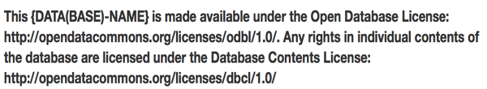

# Lesson 4.5 Open Licensing for Data

## Learning outcomes

At the end of this lesson, learners will \(be able to\):

* Understand the reasons why open data should come with an open licence
* Understand the implications of the different open licences that may be applicable to the data that you \(intend to\) use
* Have an overview of the different open licences that can be used
* Apply open licences to the data that you produced

## 1.   Introduction

In lesson 4.2, the importance of licensing data was highlighted. The recommendation was that data should always be accompanied by a licence, no matter how openly or limitedly it is being shared: licences indicate if and how the data can be reused, in any position of the data spectrum.

Considering all the different permissions that licences can give and the legal aspects involved, licenses can be very complex and tailored to each specific project, especially in the case of shared or closed data. Therefore, it is difficult to provide a comprehensive guide to licensing non-open data.

In contrast, since open data has been quite clearly defined and there is broad agreement on its main requirements, a lot of work has been done on defining standard open data licences that can be adopted as they are. This lesson focuses on open data licensing.

Sharing data on the web, making it publicly available to everyone means that data can only be viewed and read, but cannot be reused or modified legally unless permissions are explicitly given to do so on the source. Going back to the definition given in Lesson 2.1, open data is data that can be freely used, reused \(modified\) and redistributed \(shared\) by anyone. For reuse and redistribution, data must be provided under terms that permit reuse and redistribution including intermixing with other datasets. This is where the \(open\) licencing is applied to the data and you will be introduced to the terminology and existing licensing tools in this lesson.

## 2.   Licensing and reuse

Licensing means that the copyright owner retains ownership but authorises a third party to carry out certain acts covered by the economic rights, generally for a specific period of time and for a specific purpose.\[1\] In order to facilitate the reuse of data, it is indispensable that others know the terms of use for the database and the data content. To ensure that happens the rights holder should mark the data with associated permissions. There are two ways of communicating permissions to potential reusers of data. The rights holder can license a second party to do things that would otherwise infringe on the rights held; alternatively, the rights holder can give up the rights to a resource so that infringement becomes a non-issue\[2\]. In both cases, only the rights holder can grant permissions or waive the rights with a licence.

## 3.   What is an open licence?

An ‘open licence’ may sound a contradiction. In general, a licence on a certain piece of content is an agreement between two parties: the licensor and the licensee. It usually comes with provisions for terms, territory and renewal conditions.

* The terms lay down what the licensor allows the licensee to do with the content. For example, the licensee may be granted to right to use software that the licensor owns.
* The territory is the geographical area where the licence is valid. For example, a distributor may have the right to distribute books in Europe, but not in the USA.
* A renewal clause is customary because an agreement usually has a duration and can \(or cannot\) be renewed after expiration of the licence.

In the early days of the web some people mistakenly assumed that they could do anything with the content that they found there. That is a misunderstanding. If you do not have a licence, you are not allowed to do anything with data or other content beyond what is considered as ‘fair use’. If a provider wants data to be open, to be used, redistributed and mixed with other content, it should come with an appropriate licence. Such open licences are different from many other content licences:

* to achieve universal participation no licensee is specified;
* to make all uses possible the rights holder waives most or all rights so no specific terms apply;
* open data is distributed via the Internet, so the licence is not limited to a specific territory;
* the duration is the same as the duration of the rights that are being waived \(we have seen that copyrights expire after a certain time\), so there are no renewal clauses.

The following open licences are defined as complying with principles set by the Open Definition\[3\]:

* public domain licence which has no restrictions at all
* attribution licence which requires credit to the rights holder

attribution and share-alike licence which requires attribution and share any derived content or data under the same licence\[4\].

## 4.   Standard open licences

Theoretically providers could choose to make up their own bespoke open licence. But that is quite complex because the data can be reused anywhere in the world, and so the licence should be valid in many different legislations. Fortunately, there numerous standard open licences that exist in many languages and for many different legislations. These licences come with statements on different levels:

* a machine-readable version;
* the ‘commons deed’, a text that is meant to be understandable for everyone, not just legal experts;
* the ‘legal code’, a text that contains the legal statements that are formulated in such a way that they can be used in court proceedings; there are legal code documents for different national legislations.

Standard open licences are:

* Creative Commons \(CC\)
* Open Data Commons \(ODC\)
* Government licences, such as the UK Open Government Licence or the French Licence Ouverte.

There are debates about the differences between Creative Commons and Open Data Commons. Creative Commons licences can be applied to many different things that creators want to make available in the public domain, like music and music recordings, pictures, or texts\[5\]. Open Data Commons licences\[6\] deal with collections held in databases, and the structure of databases, but not the individual content items in the database.

Both CC and ODC licences are used for open data. Government licences are often used to deal with legal requirements that should be met for government organisations, such as a Freedom of Information Act. But a CC or ODC is often used for government data.

### 4.1. Creative Commons licences for creative content

Creative Commons\[7\] \(CC\) is a non-profit organisation established in 2001. CC helps to avoid the time and effort to granting/obtaining permission by providing tools to have the relevant licence on the work in a digital environment. CC licences are available in English by default, but they are also translated into other languages in other national legal systems. CC licences consist of four conditions and six main combinations.

Here are the four main conditions for CC open licences:

**Attribution \(BY\)**: All CC licences require that you must give credit to the rights holder in the way it was requested.

**ShareAlike \(SA\)**: You are allowed to copy, distribute, display, perform, and modify the work, as long as you distribute any modified work on the same terms.

**NonCommercial \(NC\)**: You are allowed to copy, distribute, display, perform, and \(unless NoDerivatives is chosen\) modify and use the work for any purpose other than commercially.

**NoDerivatives \(ND\)**: You are allowed to copy, distribute, display and perform only original copies of the work.

In addition to these four conditions, CC also provides public domain tools for which copyright interests and database rights are waived, allowing the data to be used as freely as possible:

**CC Zero \(CC0\)**:  The author waives all of his/her copyright and neighbouring and related rights on the work; the rights waived include database rights, so CC0 is suitable to use for data.

**CC Public Domain Mark \(PDM\)**: CC provides a public domain mark to generate a licence and anyone can use to assert that a work is already in the public domain.

Six main combination of licences and their details\[8\] are given below:

1. **Attribution CC BY**: This licence lets others distribute, remix, tweak, and build upon your work, even commercially, as long as they credit you for the original creation.
2. **Attribution-ShareAlike CC BY-SA**: This licence lets others remix, tweak, and build upon your work even for commercial purposes, as long as they credit you and license their new creations under the identical terms.
3. **Attribution-NonCommercial CC BY-NC**: This licence lets others remix, tweak, and build upon your work non-commercially, and although their new works must also acknowledge you and be non-commercial, they don’t have to license their derivative works on the same terms.
4. **Attribution-NoDerivs CC BY-ND**: This licence allows for redistribution, commercial and noncommercial, as long as it is passed along unchanged and in whole, with credit to you.
5. **Attribution-NonCommercial-ShareAlike \(CC BY-NC-SA\)**: This licence lets others remix, tweak, and build upon your work non-commercially, as long as they credit you and license their new creations under the identical terms.
6. **Attribution-NonCommercial-NoDerivs CC BY-NC-ND**: This licence is the most restrictive of our six main licences, only allowing others to download your works and share them with others as long as they credit you, but they can’t change them in any way or use them commercially.

‘Non-commercial’ and ‘no derivative works’ rights are seldom or never reserved for open data. If no derivative works would be allowed, combinations with other datasets or their use in apps would be blocked. There is also a grey area between commercial and non-commercial distribution, and if commercial use is excluded there is no universal participation.

It is recommended to use the latest version of the CC licences which are international. The versions of the licences prior to version 4 were not specifically aimed at data, so using them for such may presents some problems. The most significant is that they do not explicitly cover sui generis database rights such as the one in force in the European Union.\[9\]

All versions of the licences treat datasets and databases as a whole: they do not treat the individual data themselves differently from the collection/database. Therefore, they should be carefully applied in certain complex cases such as collections of variously copyrighted works.\[10\] The degree of openness in CC licences is also matter. Some of the CC licences are more ‘free’ than the others which are CC0, PDM, CC BY, and CC BY-SA and described as free culture licences.\[11\]

### 4.2 Open data licences for databases

The Open Data Commons\[12\] Project started in 2007, then transferred to Open Knowledge Foundation in 2009; it produced similar licences to CC but designed specifically for databases. Open Data Commons has three licences as follows:

* **Public Domain Dedication and Licence \(PDDL\)** – ‘Public domain for data/databases’: it allows to copy, distribute and use the database \(share\); to produce works from the database \(create\); and to modify, transform and build upon the database \(adapt\). The PDDL imposes no restrictions on the use of the PDDL licensed database.\[13\] It accomplishes the same thing in the same way as CC0 but is worded specifically in database terms.
* **Attribution Licence \(ODC-By\)** – ‘Attribution for data/databases’: it allows to copy, distribute and use the database \(share\); to produce works from the database \(create\); and to modify, transform and build upon the database \(adapt\) as long as the user attributes any public use of the database, or works produced from the database, in the manner specified in the licence.\[14\]
* **Open Database Licence \(ODC-ODbL\)** – ‘Attribution Share-Alike for data/databases’: It gives the same permissions as ODC-By. In addition, \(i\) any adapted version of this database or works produced from an adapted database should also be offered under the ODbL; \(ii\) a licensor can apply technical restrictions to new work as long as an alternative copy without the restrictions is made equally available.\[15\]

Table 1 Standard open licences compliant with Open Definition\[16\]

| **Name** | **Licence** | **Attribution \(BY\)** | **Share Alike \(SA\)** | **Remarks** |
| :--- | :--- | :--- | :--- | :--- |
| CC Zero \(CC\) | CC | No | No | All rights waived. Recommended for scientific data to make data mining and meta analyses possible |
| Public Domain Dedication and Licence \(PDDL\) | ODC | No | No | All rights waived. Recommended for scientific data to make data mining and meta analyses possible |
| Creative Commons Attribution 4.0 \(CC BY\)\[17\] | CC | Yes | No |  |
| Open Data Commons Attribution Licence \(ODC BY\) | ODC | Yes | No |  |
| Creative Commons Attribution Share Alike \(CC BY SA\) | CC | Yes | Yes |  |
| Open Database Licence \(ODbL\) | ODC | Yes | Yes |  |

## 5.   How to use open licences?

Open licences usually come with layers including human-readable and machine-readable versions. They both should clearly indicate which licence applied to your content or data and how it can be reused by others. Creative Commons and Open Data Commons define what statements and marks should be used for each of their licences on their web sites.

Creative Commons offers a web-based tool, the license chooser\[18\], to help select the right licence for your needs. Open Data Commons\[19\] similarly provides you with instructions on how to apply licences \(Figure 1 and 2\).

Having the machine-readable licence including a complete description of the metadata is important for your content and data to be correctly harvested by machines, e.g. search engines and web APIs. ODI’s Publisher's Guide to the Open Data Rights Statement Vocabulary\[20\] offers a great source on the topic. This is equally important for the licensed work to be searched, browsed or filtered correctly on search engines. This topic was discussed widely in the previous units.  

## Bibliography

M. Khayyat and F. Bannister \(2015\). Open data licensing: more than meets the eye. Information Polity, **20** \(4\), 132–251. Available online: [https://www.scss.tcd.ie/disciplines/information\_systems/egpa/docs/2014/KhayyatBannister.pdf](https://www.scss.tcd.ie/disciplines/information_systems/egpa/docs/2014/KhayyatBannister.pdf)

ODI Publisher's Guide to Open Data Licensing. Available at [https://theodi.org/guides/publishers-guide-open-data-licensing](https://theodi.org/guides/publishers-guide-open-data-licensing)

ODI Reuser's Guide to Open Data Licensing. [https://theodi.org/guides/reusers-guide-open-data-licensing](https://theodi.org/guides/reusers-guide-open-data-licensing)

OpenAIRE Training Materials: How to licence research data [https://www.openaire.eu/research-data-how-to-license/](https://www.openaire.eu/research-data-how-to-license/)

## Footnotes

\[1\] [http://www.wipo.int/edocs/pubdocs/en/wipo\_pub\_909\_2016.pdf](http://www.wipo.int/edocs/pubdocs/en/wipo_pub_909_2016.pdf)

\[2\] [http://www.dcc.ac.uk/resources/how-guides/license-research-data\#x1-4000](http://www.dcc.ac.uk/resources/how-guides/license-research-data#x1-4000)

\[3\] [http://opendefinition.org/od/2.1/en/](http://opendefinition.org/od/2.1/en/%20)

\[4\] [https://theodi.org/guides/reusers-guide-open-data-licensing](https://theodi.org/guides/reusers-guide-open-data-licensing)

\[5\] Creative Commons License Choose: [https://creativecommons.org/choose/](https://creativecommons.org/choose/)

\[6\] Open Data Commons License: [https://opendatacommons.org/licenses/](https://opendatacommons.org/licenses/)

\[7\] [https://creativecommons.org](https://creativecommons.org)

\[8\] [https://creativecommons.org/share-your-work/licensing-types-examples/licensing-examples/](https://creativecommons.org/share-your-work/licensing-types-examples/licensing-examples/)

\[9\] [http://www.dcc.ac.uk/resources/how-guides/license-research-data\#x1-8000](http://www.dcc.ac.uk/resources/how-guides/license-research-data#x1-8000)

\[10\] [http://www.dcc.ac.uk/resources/how-guides/license-research-data\#x1-8000](http://www.dcc.ac.uk/resources/how-guides/license-research-data#x1-8000)

\[11\] [https://freedomdefined.org/Definition](https://freedomdefined.org/Definition)

\[12\] [https://opendatacommons.org](https://opendatacommons.org)  

\[13\] [https://opendatacommons.org/licenses/pddl/summary/](https://opendatacommons.org/licenses/pddl/summary/)

\[14\] [https://opendatacommons.org/licenses/by/summary/](https://opendatacommons.org/licenses/by/summary/)

\[15\] [https://opendatacommons.org/licenses/odbl/summary/](https://opendatacommons.org/licenses/odbl/summary/)

\[16\] [http://opendefinition.org/licenses/](http://opendefinition.org/licenses/)

\[17\] Note that version of Creative Commons before 4.0 do not pertain to data specifically

\[18\] [https://creativecommons.org/choose/](https://creativecommons.org/choose/)

\[19\] [https://opendatacommons.org/licenses/odbl](https://opendatacommons.org/licenses/odbl)

\[20\] [https://theodi.org/guides/publishers-guide-to-the-open-data-rights-statement-vocabulary](https://theodi.org/guides/publishers-guide-to-the-open-data-rights-statement-vocabulary)

